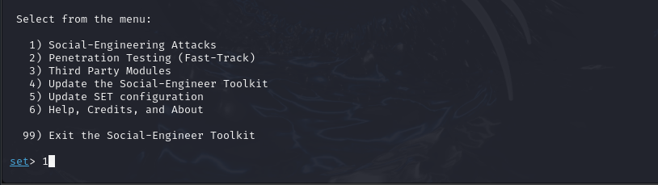
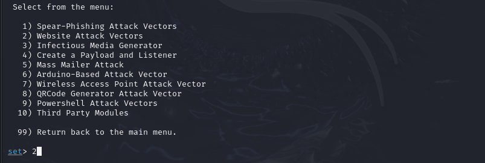
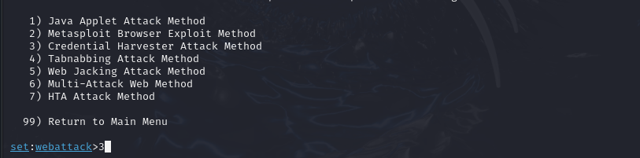

# BootCamp_cyberSec-dio-santander

# Phishing para captura de senhas

### Ferramentas

- Kali Linux
- setoolkit

### Configurando o Phishing no Kali Linux

- Acesso root: ``` sudo su ```
- Iniciando o setoolkit: ``` setoolkit ```
- Tipo de ataque: ``` Social-Engineering Attacks ```


  
- Vetor de ataque: ``` Web Site Attack Vectors ```


  
- Método de ataque: ```Credential Harvester Attack Method ```


  
- Método de ataque: ``` Site Cloner ```
  

  
- Obtendo o endereço da máquina: ``` ifconfig ``` ou utilizando o próprio endereço ip sugerido 


- URL para clone: https://cursos.alura.com.br/loginForm


### Resutados

- Informando um usuário e senha:
